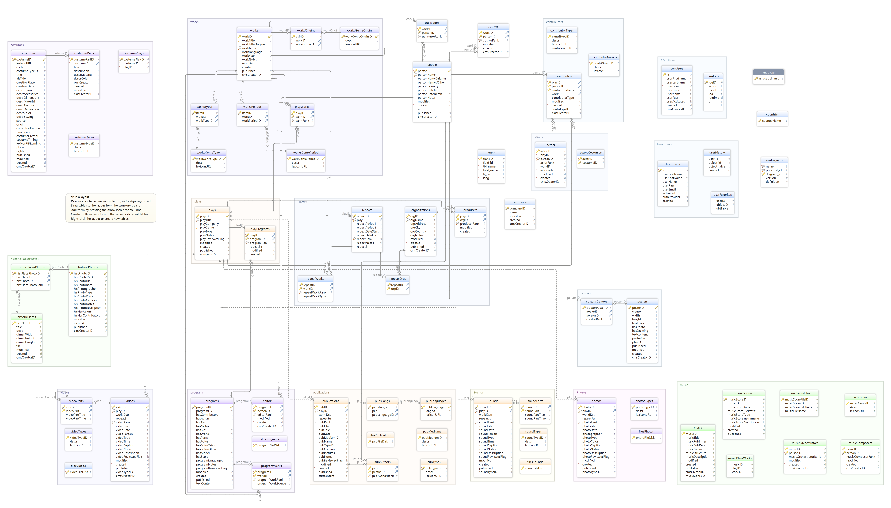

# National Theatre Assistant

The original schema of the NT Archive's SQL database is the following:



To allow text2SQL functionality, we converted the original MS SQL dump to an sqlite database using the
[convert_mssql_to_sqlite.py](convert_mssql_to_sqlite.py) script

```
usage: convert_mssql_to_sqlite.py [-h] [--sql-server-dump SQL_SERVER_DUMP] [--sqlite-db SQLITE_DB] [--encoding ENCODING]

Convert SQL Server dump to SQLite

optional arguments:
  -h, --help            show this help message and exit
  --sql-server-dump SQL_SERVER_DUMP
                        Path to the SQL Server dump file (default: None)
  --sqlite-db SQLITE_DB
                        Name of the SQLite database file (default: converted_db.sqlite)
  --encoding ENCODING   Encoding of the SQL Server dump file (default: utf-16-le)
```

e.g., `python convert_mssql_to_sqlite.py --sql-server NT_DB_20240730.sql`

Note that if there are any errors during conversion, it is most likely due to a schema update. You'll see the error message on the terminal, and you can either 1) ignore the new table by adding it to the "tables_to_ignore" list, or 2) create the corresponding table ("create_sqlite_tables").

Next, we simplified the database using the
[create_mini_db.py](create_mini_db.py) script.

```
usage: create_mini_db.py [-h] [--original-db-name ORIGINAL_DB_NAME] [--minimal-db-name MINIMAL_DB_NAME] [--base-url BASE_URL]

A script that accepts original DB name, minimal DB name, and base URL as arguments.

optional arguments:
  -h, --help            show this help message and exit
  --original-db-name ORIGINAL_DB_NAME
                        Original SQLite database name (the output of create_sqlite_db.py) (default: converted_db.sqlite)
  --minimal-db-name MINIMAL_DB_NAME
                        Mini SQLite database name that will be used by the VA (default: minimal_nt.db)
  --base-url BASE_URL   Base URL (default: http://194.177.217.106/)
```

e.g., `python create_mini_db.py --base-url http://www.nt-archive.gr/`

or `python create_mini_db.py --base-url "/"` for a relative path.

The new database (minimal_nt.db) has the following tables: plays, works, playworks, actors, authors, people.

# How to run

## Dockerized version

If you want to access the logs you need to attach /app/logs to a host path:

```
docker build --no-cache -t ntchat .
docker run -v $PWD/nt_logs:/app/logs -p 9500:9500 -ti ntchat

# alternatively, use the following command if you want it to run in the background and restart:
docker run -d --restart always -v $PWD/nt_logs:/app/logs -p 9500:9500 -ti ntchat
```


After you run the app, navigate to `localhost:9500`.

Or:

## Install in a virtual environemnt

Install the [requirements](requirements.txt) in a virtual environment and activate it.

To run the service and the widget:

```
# add the current path to PYTHOPATH
export PYTHONPATH=$(pwd)

python nt_chat/app.py
```

## Interact with the service via the CLI

You have the option to use the CLI interacrively instead of the UI (widget). After you set up the service (via the docker or `python nt_chat/app.py`), run:

```
python testws.py
```

# JobRuntime Benchmarks

To get the JobRuntime benchmarks, simply start a server without caching and run:

```
bach benchmark_ws.sh
```

*Important*: To disable caching, make sure you .env and .env.production have:

`USE_CACHE=False`

Otherwsie some items will be cached and the benchmark will show faster times for repeated items

# Issues:

- "ο κουρέας της Σεβίλλης" --> "κουρεύς της Σεβίλλης" in the db, there may be
  more playTitles that use nominative in ancient Greek. (Or:
  `βάτραχοι του Αριστοφάνη` instead of `βατράχια`)
- The model has hallucinated in the past when the db results are null (see
  the open langchain issue
  [here](https://github.com/langchain-ai/langchain/issues/1254)). It seems that we have solved it via prompting, but we can't be 100% sure.
- Some non-Greek names are in Greek (e.g., Μπρεχτ) while others in English (e.g., Dario Fo). This might be solved if we merge the English and Greek-ified names once the translations are ready.
- θέλω να δω υλικό από την Γκόλφω του Καραθάνου. (genitive: part of the 1)
  title, 2) writer, or 3) director (we should add the director to the db)? -->

```
SQLQuery:SELECT plays.playTitle, plays.yearStarted, plays.yearEnded, plays.photosURL, plays.publicationsURL, plays.programsURL, plays.soundsURL, plays.videosURL, plays.musicSheetsURL
FROM plays
JOIN playworks ON plays.playID = playworks.playID
JOIN works ON playworks.workID = works.workID
WHERE works.workTitle COLLATE NOCASE LIKE '%Γκόλφω του Καραθάνου%'
LIMIT 10;
SQLResult:
Answer:Δεν βρήκα αποτελέσματα στο αρχείο για την παράσταση "Γκόλφω του Καραθάνου".
```
- Similarly: 1) `τι άλλο παρουσιάστηκε στην Επίδαυρο το καλοκαίρι του 2003;`
  (where on plays/repeats can I find info on Επίδαυρος?) and 2)
  `Θέλω να δω μακέτες σκηνικών για παραστάσεις έργων του Σέξπιρ.`
- Each QA process takes a few seconds..

# Question examples (provided by Alexia)

- Ψάχνω ο/α υλικό από παραστάσεις του Αμφιτρύωνα που ανέβηκαν στο Εθνικό Θέατρο.
- Άκουσα τη φωνή του Ντίνου Ηλιόπουλου στο αρχείο ήχου της παράστασης. Υπάρχει ο
  ίδιος ηθοποιός σε μαγνητοσκοπημένη παράσταση;
- Θέλω να δω ελληνικά έργα που ανέβηκαν στο ΕΘ τα τελευταία χρόνια.
- Μπορείς να μου πεις αν σε κάποιο από αυτά τα έργα έπαιξε η Μαρία Ναυπλιώτου;
- Έχει ξαναπαρουσιαστεί ο Ιππόλυτος από το ΕΘ;
- Ψάχνω υλικό από παραστάσεις της Ηλέκτρας.
- ψάχνω τις περιοδείες του ΕΘ στο εξωτερικό

For a broader list, go to [this file](quality_assessment_prompts.txt)

# Future Features

If we want we can add memory
(https://python.langchain.com/docs/modules/memory/adding_memory) to the chat,
but we will probably have issues with the tokens.

# Σενάρια

1) Αναζήτηση παραστάσεων
2) Αναζήτηση έργου
3) Αναζήτηση προσώπου
4) Αναζήτηση ο/α υλικού από παράσταση (βίντεο, φωτογραφίες, ήχοι)
5) Αναζήτηση ο/α υλικού (π.χ., μαγνητοσκόπηση) από παράσταση στην οποία παίζει συγκεκριμένος ηθοποιός
6) Αναζήτηση δημοσιεύσεων, προγραμμάτων, και πόστερ παράστασης
7) Αναζήτηση παραστάσεων που έχουν κάνει περιοδία στο εξωτερικό (ή σε συγκεκριμένη χώρα)
8) Αναζήτηση συγγραφέα έργου
9) Αναζήτηση έργων στα οποία πρωταγωνιστεί συγκεκριμένος ηθοποιός
10) Αναζήτηση έργων βάσει έτους ή ακόμα και εύρους ετών (π.χ., "την τελευταία τριετία")
